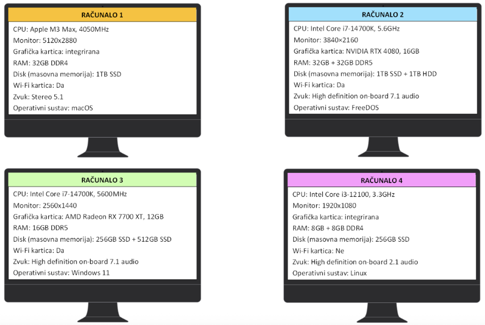

# Kviz: konfiguracija računala



```{mchoice}
:answer1: 1;
:answer2: 2;
:answer3: 3;
:answer4: 4;
:correct: 4

Kada bi gledali procesor, radnu memoriju i graficku karticu koje bi racunalo bilo najslabije?
```

```{mchoice}
:answer1: 1;
:answer2: 2;
:answer3: 3;
:answer4: 4;
:correct: 2

Kada bi gledali procesor, radnu memoriju i graficku karticu koje bi racunalo bilo najjace?
```

```{mchoice}
:answer1: 1;
:answer2: 2;
:answer3: 3;
:answer4: 4;
:correct: 1

Koji monitor ima najbolju rezoluciju?
```

```{mchoice}
:answer1: 1;
:answer2: 2;
:answer3: 3;
:answer4: 4;
:correct: 2

Koje racunalo ima najviše radne memorije?
```

```{mchoice}
:answer1: 1;
:answer2: 2;
:answer3: 3;
:answer4: 4;
:correct: 4

Koje racunalo pruža najlošiju kvalitetu zvuka?
```

```{mchoice}
:answer1: 1;
:answer2: 2;
:answer3: 3;
:answer4: 4;
:correct: 2,3

Koje racunalo ima najbrži procesor?
```

```{mchoice}
:answer1: 1;
:answer2: 2;
:answer3: 3;
:answer4: 4;
:correct: 4

Na kojem racunalu se može pohraniti najmanje podataka?
```

```{mchoice}
:answer1: 1;
:answer2: 2;
:answer3: 3;
:answer4: 4;
:correct: 2

Koje racunalo ima najbolju kombinaciju diskova za pohranu velike kolicine podataka?
```

```{mchoice}
:answer1: 1;
:answer2: 2;
:answer3: 3;
:answer4: 4;
:correct: 4

Koje racunalo se ne može spojiti na bežicnu mrežu?
```

```{mchoice}
:answer1: 1;
:answer2: 2;
:answer3: 3;
:answer4: 4;
:correct: 3

Na kojem racunalu je Microsoft operacijski sustav?
```