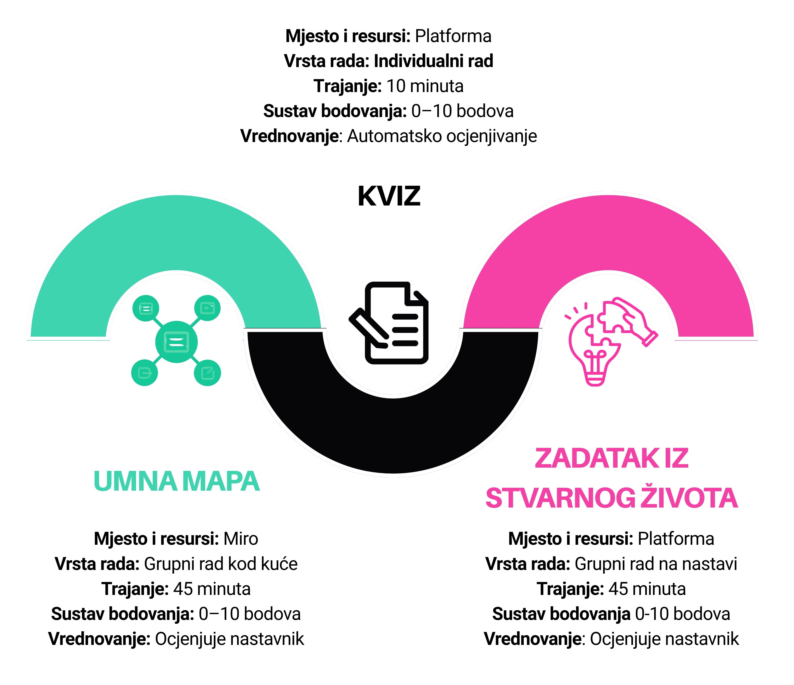

# Struktura lekcije

**Ova lekcija ima tri komponente:**

Na kraju nastavnog sata vrednovat će se svaki dio vašeg rada:

- **Izrada mentalne mape** – struktura, sadržaj, jasnoća prikaza i suradnja u skupini (10 bodova)

- **Samostalni zadatak** – točnost odgovora i razumijevanje sadržaja u kvizu (10 bodova)

- **Rad u skupini** – doprinos timskom radu, argumentiranje ideja i sudjelovanje u raspravi (10 bodova)

| Zaključna ocjena	|Bodovi|
| ------------------|------|
| Odličan (5)	|27–30|
| Vrlo dobar (4)	|23–26|
| Dobar (3)	|19–22|
| Dovoljan (2)	|15–18|
| Nedovoljan (1)	 |0–14|

Vaša konačna ocjena neće ovisiti samo o znanju, nego i o načinu na koji sudjelujete u radu, surađujete s drugima i doprinosite pozitivnoj radnoj atmosferi unutar tima. Kako bi rad u timu bio uspješan, važno je pridržavati se sljedećih pravila suradnje:
- 	Svi članovi tima imaju jednaku vrijednost i prema svima se odnosimo s poštovanjem.
- 	Održavamo konstruktivnu i pozitivnu atmosferu, čak i kada imamo različita mišljenja.
- 	Svaki član preuzima odgovornost za svoj doprinos i za zajednički rezultat tima.
- 	Potičemo sve članove da aktivno sudjeluju u rješavanju zadatka.
- 	U donošenje odluka nastojimo uključiti sve članove tima.
- 	Razmatramo različite ideje i biramo rješenje koje najbolje odgovara zadatku.
- 	Ideje razvijamo zajednički, raspravljamo o njima i oblikujemo konačna rješenja.
- 	Vrijeme koristimo odgovorno kako bismo zadatak dovršili u predviđenom roku.
- 	Pratimo napredak skupine i dogovaramo daljnje korake.

Na sljedećoj stranici pronaći ćeš upute za izradu mentalne mape.
